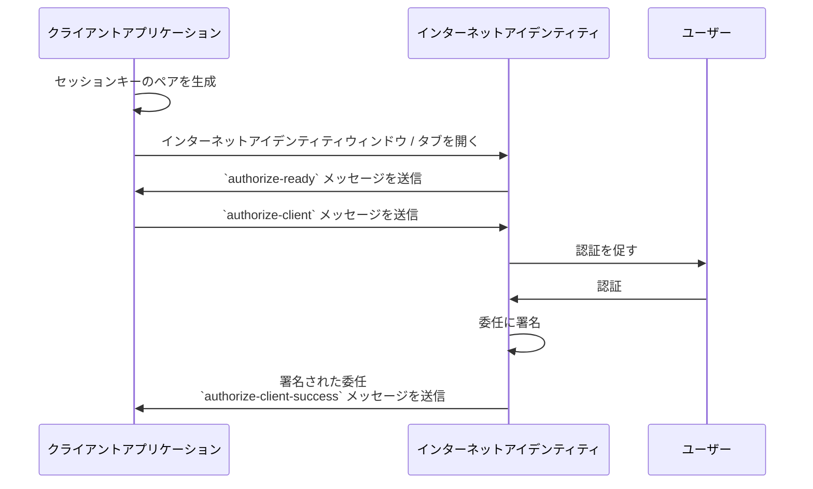

https://internetcomputer.org/docs/references/ii-spec

https://github.com/dfinity/internet-identity/blob/main/docs/ii-spec.mdx


インターネットアイデンティティ仕様書

## はじめに

この文書では、インターネットアイデンティティをさまざまな観点から、さまざまな抽象レベルで説明し、仕様化します。具体的には、以下の内容を含みます。

- 高レベルの目標、要件、ユースケース。
- アイデンティティ、鍵、委任の相互作用を含む、セキュリティとアイデンティティ機構の概要。
- クライアントアプリケーションのフロントエンドで使用されるインターフェース、すなわち、私たちの[クライアント認証プロトコル](#client-authentication-protocol)。
- インターネットアイデンティティサービスの*バックエンド*のインターフェース、すなわち、フロントエンドで使用されるCandidレイヤーでの契約の記述。
- インターネットアイデンティティサービスバックエンドに関する重要な実装ノート。

インターネットアイデンティティサービスは、以下で構成されます：

- そのバックエンド、ICP上のカニスター。より正確には、*よく知られた*カニスターIDを持つ専用サブネット上のカニスターであり、
- そのフロントエンド、バックエンドカニスターから提供されるウェブアプリケーション。

同様に、クライアントアプリケーションは、フロントエンド（カニスターから提供）と（通常）1つ以上のバックエンドカニスターで構成されています。インターネットアイデンティティサービスと直接やり取りするのはフロントエンドのみです（以下で説明する[クライアント認証プロトコル](#client-authentication-protocol)を通じて）。

## 目標、要件、およびユースケース

インターネットアイデンティティサービスは、ユーザーが以下を行うことを可能にします：

- インターネットコンピュータ上でアイデンティティを維持する
- 一連のセキュリティデバイスを使用してこれらのアイデンティティでログインする
- セキュリティデバイスのセットを管理する

いくつかの機能要件は次の通りです：

- ユーザーはクライアントアプリケーションごとに（より正確には、クライアントアプリケーションフロントエンド「ホスト名」ごとに）別々のアイデンティティ（または「偽名」）を持つ。
- これらのアイデンティティは安定しており、ユーザーのセキュリティデバイスに依存しない。
- クライアントフロントエンドは、ユーザーのアイデンティティを持つそのフロントエンドでインターネットコンピュータ上の任意のカニスターとやり取りする。
- ユーザーは秘密情報を決して記憶する必要はない（ただし、ユーザー固有の非秘密情報はあるかもしれない）。
- セキュリティデバイスは、クライアントアプリケーションとの各インタラクションで毎回手動で触れる必要はない。ログインは、アイデンティティごとに一定の期間有効である。

いくつかのセキュリティ要件は次の通りです：

- 単一のユーザーの異なるアイデンティティは、公開鍵やプリンシパルIDのみに基づいて関連付けられてはならず、ユーザーの追跡を防ぐ。
- アイデンティティのセキュリティは、カニスター上に保存されているデータのプライバシーや、カニスターへの送受信に依存しない。特に、バックエンドカニスターによって渡される委任は機密情報であってはならない。
- （もちろん、他にも多くのセキュリティの前提条件がある；常識を適用する）

注目すべきセキュリティの前提条件は以下の通りです：

- フロントエンドアプリケーションの配信は安全である。特に、TLSで保護されたHTTP接続を通じてインターネットアイデンティティサービスのフロントエンドにアクセスするユーザーは、別のウェブアプリケーションを実行するように騙されることはない。

:::note
背景情報として：ローンチ時には、境界ノードの信頼性と、境界ノードがアセットを取得するレプリカの信頼性に依存していました。ローンチ後は、HTTPゲートウェイプロトコルの証明と信頼できるクライアントサイドコード（ブラウザ拡張機能、プロキシなど）が状況を改善しました。
:::

- セキュリティデバイスは、キーを作成したのと同じウェブアプリケーションからのみキーの使用を許可する（この場合、インターネットアイデンティティサービスフロントエンド）。
- ユーザーのブラウザは信頼できるものであり、異なるオリジン間での`postMessage`通信は信頼できるものである。
- ユーザープライバシーのために、インターネットアイデンティティサービスバックエンドが秘密を保持できると仮定しています（ただし、データは複製されるため、この前提に依存して他のセキュリティプロパティを構築しているわけではありません）。

## アイデンティティ設計とデータモデル

インターネットコンピュータは、`https://identity.ic0.app`（公式）および`https://identity.internetcomputer.org`（実験的）というホスト名の下でこのフロントエンドを提供します。

カニスターは、インターネットコンピュータのセキュアなランダム性の源を通じて得られる32バイト長のブロブである塩（以下、`salt`）を保持します。

:::note
カニスターでのデータ複製のため、この塩は決定的な攻撃者に対して秘密と見なされるべきではありません。しかし、カニスターは塩を直接公開せず、攻撃者がそれを知らない範囲で、ユーザーアイデンティティのプライバシーを維持するのに役立ちます。
:::

ユーザーアカウントは一意の*アイデンティティアンカー*で識別され、これはカニスターによって選ばれた自然数です。

クライアントアプリケーションフロントエンドは、そのオリジン（例えば、`https://abcde-efg.ic0.app`、`https://nice-name.com`）で識別されます。フロントエンドアプリケーションは、カニスターまたはインターネットコンピュータ上でホストされていないウェブサイトによって提供される場合があります。

ユーザーは、各クライアントアプリケーションフロントエンド（すなわち、オリジンごと）について別々の*ユーザーアイデンティティ*を持ちます。このアイデンティティは、[DERエンコードされたカニスター署名公開鍵](https://internetcomputer.org/docs/current/references/ic-interface-spec/#canister-signatures)の[*自己認証ID*](https://internetcomputer.org/docs/current/references/ic-interface-spec#id-classes)です。

そのアイデンティティは次のような形式になります：

```
user_id = SHA-224(DERエンコードされた公開鍵) · 0x02（29バイト）
```

そして、DERエンコードされた公開鍵の`BIT STRING`フィールドは次の形式になります：

```
bit_string = |ii_canister_id| · ii_canister_id · seed
```

ここで、`seed`は次のように導出されます：

```
seed = H(|salt| · salt · |user_number| · user_number · |frontend_origin| · frontend_origin)
```

ここで、`H`はSHA-256、`·`は連結、`|…|`は`…`のバイト数を表す1バイトの長さ、`user_number`はアイデンティティアンカーのASCIIエンコードされた十進数、`frontend_origin`はクライアントアプリケーションフロントエンドのオリジンのASCIIエンコードです（最大255バイト）。

:::note
`frontend_origin`が`https://<canister id>.icp0.io`の形式である場合、`seed`で使用する前に`https://<canister id>.ic0.app`に書き換えられます。これにより、`ic0.app`と`icp0.io`ドメインでホストされているアプリケーション間で透過的な偽名の移行が保証されます。
:::

クライアントアプリケーションフロントエンドがユーザーとして認証しようとする場合、*セッションキー*（例：Ed25519またはECDSA）を使用し、認証フローを通じて[*委任チェーン*](https://internetcomputer.org/docs/current/references/ic-interface-spec#authentication)を取得します。この委任チェーンは、セッションキーがユーザーのメインアイデンティティに署名できるようにします。

委任チェーンは1つの委任で構成され、これを*クライアント委任*と呼びます。これはユーザーアイデンティティ（指定されたクライアントアプリケーションフロントエンドのための）からセッションキーへの委任です。この委任はインターネットアイデンティティサービスカニスターによって作成され、[カニスター署名](https://internetcomputer.org/docs/current/references/ic-interface-spec/#canister-signatures)を使用して署名されます。この委任は無制限スコープ（すべてのカニスターに対して有効）であり、最大で30日間の有効期限を持ち、デフォルトでは30分です。

インターネットアイデンティティサービスフロントエンドは、*アイデンティティフロントエンド委任*も管理しており、これはセキュリティデバイスの公開鍵からセッションキーへの委任です。これにより、セキュリティデバイスに対して毎回署名を依頼することなくバックエンドとやり取りできます。

## クライアント認証プロトコル

このセクションでは、クライアントアプリケーションフロントエンドから見たインターネットアイデンティティサービスを説明します。



1. クライアントアプリケーションフロントエンドは、セッションキーのペア（例：Ed25519）を作成します。
2. それは自分の`window`に`message`イベントハンドラをインストールします。
3. `https://identity.ic0.app/#authorize`のURLを別タブで読み込みます。このタブから返される`Window`オブジェクトを`identityWindow`と呼びます。
4. `identityWindow`でユーザーがログインし、`identityWindow`は次のように呼び出します：
   ```ts
   window.opener.postMessage(msg, "*")
   ```
   ここで、`msg`は次の型のメッセージです：
   ```ts
   interface InternetIdentityReady {
     kind: "authorize-ready"
   }
   ```
5. クライアントアプリケーションは、`InternetIdentityReady`を受け取った後、次のように呼び出します：
   ```ts
   identityWindow.postMessage(msg, "https://identity.ic0.app")
   ```
   ここで、`msg`は次の型のメッセージです：
   ```ts
   interface InternetIdentityAuthRequest {
     kind: "authorize-client";
     sessionPublicKey: Uint8Array;
     maxTimeToLive?: bigint;
     allowPinAuthentication?: boolean;
     derivationOrigin?: string;
     autoSelectionPrincipal?: string
   }
   ```
   ここでのフィールドは以下のようになります：
   - `sessionPublicKey`: セッションキーの公開鍵。
   - `maxTimeToLive`: 任意で、委任が期限切れになるまでの時間（ナノ秒単位）。
   - `allowPinAuthentication`: （実験的）ユーザーが一時的なキーやPINアイデンティティを使って認証・登録できるかどうか。
   - `derivationOrigin`: 任意で、プリンシパルの導出に使用するオリジンを指定します。
   - `autoSelectionPrincipal`: 任意で、委任を要求するために使用されるdappのプリンシパルのテキスト表現。

6. クライアントアプリケーションウィンドウは、`event`というデータでのメッセージを待ちます。
7. もし`event.origin`が`"https://identity.ic0.app"`または`"https://identity.internetcomputer.org"`でなければ、このメッセージは無視します。
8. `event.data`の値は次の型を持つJSオブジェクトです：
   ```ts
   interface InternetIdentityAuthResponse {
     kind: "authorize-client-success";
     delegations: [{
       delegation: {
         pubkey: Uint8Array;
         expiration: bigint;
         targets?: Principal[];
       };
       signature: Uint8Array;
     }];
     userPublicKey: Uint8Array;
     authnMethod: "passkey";
   }
   ```
   ここで、`userPublicKey`は与えられたフロントエンドのユーザーのアイデンティティであり、`delegations`は[インターネットコンピュータでの認証](https://internetcomputer.org/docs/current/references/ic-interface-spec#authentication)に使用されるCBORエンコードされた委任チェーンです。

9. 失敗した場合、次のような失敗メッセージが届くこともあります：
   ```ts
   interface InternetIdentityAuthResponse {
     kind: "authorize-client-failure";
     text: string;
   }
   ```

クライアントアプリケーションフロントエンドは、委任チェーン内のいずれかの委任が期限切れになった場合、ユーザーを再認証する必要があります。

[`@dfinity/auth-client`](https://www.npmjs.com/package/@dfinity/auth-client) NPMパッケージは、この機能をサポートします。

クライアントアプリケーションフロントエンドは、委任チェーンの長さが1を超えている場合や、`targets`を持つ委任もサポートするべきです。

:::note
インターネットアイデンティティフロントエンドは、`event.origin`を「フロントエンドURL」として使用して、ユーザーのアイデンティティを基にします。これには、プロトコル、完全なホスト名、ポートが含まれます。つまり、

- プロトコル、ホスト名（サブドメインを含む）、またはポートが変更されると、すべてのユーザーアイデンティティが無効になります。
  - ただし、複数の異なるフロントエンドURLは、標準のフロントエンドURLにマッピングできます。[Alternative Frontend Origins](#alternative-frontend-origins)を参照。
  - `icp0.io`ドメインのフロントエンドURLは、自動的に`ic0.app`にマッピングされます。[Identity design and data model](#identity-design-and-data-model)を参照。
- フロントエンドアプリケーションは、そのオリジン上で、信頼されていないJavaScriptコードの実行を決して許可してはなりません。インターネットコンピュータ上でJavaScriptプレイグラウンドを実装する際は注意が必要です。
:::

## Alternative Frontend Origins（代替フロントエンドオリジン）

カニスターのフロントエンドURLに柔軟性を持たせるために、クライアントは`derivationOrigin`として別のURLを提供することができます（[Client authentication protocol](#client-authentication-protocol)を参照）。これにより、インターネットアイデンティティは、`derivationOrigin`が直接使用される場合と同じプリンシパルをフロントエンドに発行します。この機能は、`canisterId`ベースのURLや[ICPカスタムドメイン](https://internetcomputer.org/docs/current/developer-docs/web-apps/custom-domains/using-custom-domains)（カニスターに基づく）で`derivationOrigin`を使用する場合に機能します。

:::caution
この機能は、単一のサービスのオリジンに対して柔軟性を持たせるために設計されています。_第三者_サービスが同じプリンシパルを使用することを許可するためにこの機能を使用しないでください。`/.well-known/ii-alternative-origins`に完全に管理されているオリジンのみを追加し、管理していないオリジンを`derivationOrigin`として設定しないでください！
:::

:::note
`https://<canister_id>.ic0.app`と`https://<canister_id>.raw.ic0.app`は、デフォルトでは同じプリンシパルを発行しません。しかし、この機能は、`https://<canister_id>.raw.ic0.app`を`https://<canister_id>.ic0.app`のプリンシパルに、またはその逆にマッピングするためにも使用できます。
:::

インターネットアイデンティティが`derivationOrigin`を受け入れるためには、クライアントアプリケーションのオリジンが、URL `https://<canister_id>.icp0.io/.well-known/ii-alternative-origins`で提供されるJSONオブジェクトにリストされている必要があります（つまり、ファイルはICPカニスターによってホストされ、そのカニスターは[こちら](https://internetcomputer.org/docs/current/references/http-gateway-protocol-spec)に記載された`http_request`クエリコールを実装する必要があります）。

### JSONスキーマ {#alternative-frontend-origins-schema}

```json
{
  "$schema": "https://json-schema.org/draft/2020-12/schema",
  "title": "II Alternative Origins Principal Derivation Origins",
  "description": "指定されたカニスターの代替フロントエンドオリジンを含むオブジェクトで、このドキュメントがホストされているURLを使用してプリンシパル導出が許可されているオリジン。",
  "type": "object",
  "properties": {
    "alternativeOrigins": {
      "description": "許可された代替フロントエンドオリジンのリスト",
      "type": "array",
      "items": {
        "type": "string"
      },
      "minItems": 0,
      "maxItems": 10,
      "uniqueItems": true
    }
  },
  "required": ["alternativeOrigins"]
}
```

### 例
```json
{
  "alternativeOrigins": [
    "https://alternative-1.com",
    "https://www.nice-frontend-name.org"
  ]
}
```

:::note
パス`/.well-known/ii-alternative-origins`は、常に非RAWの`https://<canister_id>.ic0.app`ドメインを使用して要求されます（`derivationOrigin`が`.raw`を使用する場合でも）。このパスは、認証されたアセットとして提供されなければなりません。`/.well-known/ii-alternative-origins`へのリクエストには、`200`のHTTPステータスコードで応答する必要があります。インターネットアイデンティティはリダイレクトを追跡せず、代わりにエラーで失敗します。この措置は、悪意のある境界ノードやレプリカが`ii-alternative-origins`を改ざんするのを防ぐために必要です。
:::

:::note
この機能の誤用を防ぐため、代替オリジンの数は_最大で10個_でなければなりません。
:::

:::note
インターネットアイデンティティが`/.well-known/ii-alternative-origins`のパスを読み取るためには、CORSレスポンスヘッダー[`Access-Control-Allow-Origin`](https://developer.mozilla.org/en-US/docs/Web/HTTP/Headers/Access-Control-Allow-Origin)を設定し、インターネットアイデンティティオリジン`https://identity.ic0.app`を許可する必要があります。
:::

## インターネットアイデンティティサービスバックエンドインターフェース

このセクションでは、バックエンドカニスターが提供するインターフェースを説明します。

インターフェースは4つのカテゴリに分かれています：
* アイデンティティ管理API、つまり、エンドユーザーが自分のアイデンティティを管理するためのAPI。
  * レガシーAPI。
  * API v2（実験的、未完成）。
    * API v2の目的は、レガシーAPIの既存クライアントを壊すことなく行えない変更を導入することです。API v2は、レガシーAPIと機能的に同等ですが、望ましい変更は完全には実装されていません：
      * メソッドは、適切な結果を意味のあるエラーで返すべきです。
      * セキュリティクリティカルな操作にWebAuthn署名を追加すること。
* HTTPゲートウェイプロトコル、`https://identity.ic0.app`の提供に必要。
* 認証プロトコル、署名付き委任を作成するためのもの。
* 検証可能な資格情報プロトコル、IDエイリアス資格情報を作成するためのもの。
* 内部メソッド、外部クライアントが呼び出すことを意図しないメソッド。
    * これらは、II自体の初期化およびそのアーカイブとの統合に関連するメソッドです。

インターフェースの概要はCandidインターフェースによって提供されます：

<CodeBlock language="candid">{IICandidInterface}</CodeBlock>

### アイデンティティ管理（レガシーAPI）

#### `create_challenge` と `register` メソッド

**認証**: この`register`リクエストは、指定された`DeviceKey`から導出された自己認証IDを持つ`caller`とともにカニスターに送信する必要があります。

`register`メソッドは、新しいユーザーを作成するために使用されます。インターネットアイデンティティサービスバックエンドは*新しい*アイデンティティアンカーを作成し、アカウントレコードを作成し、指定されたデバイスを最初のデバイスとして追加します。

インターネットコンピュータが「無料」の更新コールを多数受けるのを防ぐため、およびインターネットアイデンティティサービスがユーザー登録の過剰を防ぐため、この呼び出しはCAPTCHAチャレンジで保護されています。`register`呼び出しは、`ChallengeResult`が`create_challenge`（後述）で作成されたチャレンジの`key`を含み、かつその`chars`がインターネットアイデンティティサービス内でその`key`に関連付けられている文字と一致する場合にのみ成功します。

#### `add` メソッド

:::note
API v2: `authn_method_add`
:::

**認証**: このリクエストは、ユーザーの以前のデバイスの公開鍵から導出された自己認証IDを持つ`caller`とともにカニスターに送信する必要があります。

`add`メソッドは、ユーザーのレコードに新しいデバイスを追加します。

インターネットアイデンティティサービスバックエンドは、ユーザーが指定した公開鍵のデバイスをすでに持っている場合、この呼び出しを拒否します。

ユーザーが多すぎるデバイスを登録しようとしている場合にも、このメソッドは失敗します。

#### `remove` メソッド

:::note
API v2: `authn_method_remove`
:::

**認証**: このリクエストは、ユーザーの以前のデバイスの公開鍵から導出された自己認証IDを持つ`caller`とともにカニスターに送信する必要があります。

`remove`メソッドは、ユーザーが持っているデバイスのリストから、公開鍵で識別されたデバイスを削除します。

このリクエストに署名したデバイス自体を削除することも許可されています。これにより、緊急時のボタン機能として使用できます。

最後のデバイスを削除することも許可されており、その場合、ユーザーは完全に無効化されます。その場合、カニスターはそのユーザーを完全に忘れることができます。これは、アイデンティティアンカー生成アルゴリズムが新しいユーザーに同じアイデンティティアンカーを付与しないことを前提にしています。

フロントエンドUIは、ユーザーがこれらの操作を誤って行わないようにする責任を負います。

:::note
デバイスに`protected`フラグが設定されている場合、このリクエストはそのデバイスの公開鍵から導出された自己認証IDを持つ`caller`とともに送信される必要があります。
:::

#### `replace` メソッド

:::note
API v2: `authn_method_replace`
:::

**認証**: このリクエストは、ユーザーの以前のデバイスの公開鍵から導出された自己認証IDを持つ`caller`とともにカニスターに送信する必要があります。

`replace`メソッドは、ユーザーが持っているデバイスのリストから指定された公開鍵のデバイスを、引数として提供された別のデバイスと原子的に置き換えます。

署名に使用されたデバイス自体を置き換えることも許可されています。`replace`メソッドは、リカバリーフレーズを他のものと置き換えるために便利であり、常に1つのリカバリーフレーズがアイデンティティに関連付けられていることを確保します。

フロントエンドUIは、ユーザーがこれらの操作を誤って行わないようにする責任を負います。

:::note
デバイスに`protected`フラグが設定されている場合、このリクエストはそのデバイスの公開鍵から導出された自己認証IDを持つ`caller`とともに送信される必要があります。
:::

#### `enter_device_registration_mode` メソッド

:::note
API v2: `authn_method_registration_mode_enter`
:::

**認証**: このリクエストは、ユーザーの以前のデバイスの公開鍵から導出された自己認証IDを持つ`caller`とともにカニスターに送信する必要があります。

このメソッドは、指定されたアイデンティティアンカーに対してデバイス登録モードを有効にします。デバイス登録モードがアクティブな場合、新しいデバイスは`add_tentative_device`および`verify_tentative_device`を使用して追加できます。デバイス登録モードは最大15分間、またはフローが完了または中止されるまでアクティブです。

#### `exit_device_registration_mode` メソッド

:::note
API v2: `authn_method_registration_mode_exit`
:::

**認証**: このリクエストは、ユーザーの以前のデバイスの公開鍵から導出された自己認証IDを持つ`caller`とともにカニスターに送信する必要があります。

このメソッドは、デバイス登録モードを直ちに終了します。未確認の仮のデバイスは破棄されます。

#### `add_tentative_device` メソッド

:::note
API v2: `authn_method_register`
:::

**認証**: このリクエストは誰でも呼び出すことができます。

新しいデバイスを仮にアイデンティティアンカーに追加し、確認コードを返します。このコードは、`verify_tentative_device`メソッドでこのデバイスを確認するために使用する必要があります。フローが中止されるか15分以内に完了しない場合、仮のデバイスは破棄されます。

仮に追加されたデバイスは、管理ビューにログインしたり、他のdAppの認証を許可したりすることはできません。

#### `verify_tentative_device` メソッド

:::note
API v2: `authn_method_confirm`
:::

**認証**: このリクエストは、ユーザーの以前のデバイスの公開鍵から導出された自己認証IDを持つ`caller`とともにカニスターに送信する必要があります。

デバイス登録モードのアンカーに対して、有効な確認コードとともに呼び出すと、仮のデバイスが通常のデバイスとしてアンカーに追加され、登録モードが終了します。このメソッドが5回無効な確認コードで呼び出されると、登録フローは中止されます。

このメソッドは、登録モードでないデバイスに対して呼び出されるとエラーを返します。

#### `lookup` クエリメソッド

:::note
API v2: `identity_authn_info`
:::

**認証**: このリクエストは誰でも呼び出すことができます。

ユーザーに関連するすべてのデバイスデータを取得します。このメソッドは誰でも呼び出すことができるため、返される情報は制限されます。特に、個人情報を含む可能性のあるフィールド（メタデータやエイリアスフィールドなど）は削除されます。

#### `get_anchor_info` メソッド

:::note
API v2: `identity_info`
:::

**認証**: このリクエストは、ユーザーの以前のデバイスの公開鍵から導出された自己認証IDを持つ`caller`とともにカニスターに送信する必要があります。

アイデンティティアンカーに関連するすべてのデータを取得します。これには、登録モードや仮の登録デバイスが含まれます。

#### `get_principal` クエリメソッド
**認証**: このリクエストは、ユーザーの以前のデバイスの公開鍵から導出された自己認証IDを持つ`caller`とともにカニスターに送信する必要があります。

指定されたユーザーとフロントエンドに関連するプリンシパルを取得します。

### アイデンティティ管理（API v2のみ）

#### `identity_registration_start` メソッド

**認証**: 非匿名アイデンティティは、このメソッドを呼び出すことができます。

新しいアイデンティティの登録を開始します。アイデンティティ登録は複数のステップで構成されます：
1. 登録の開始（この呼び出し）。
2. CAPTCHAの解決（必要な場合）。このステップが必要かどうかは、最初の呼び出しの結果によって示されます。
3. 今後使用する認証方法を提供します。

`sender`プリンシパルは、その後のすべての呼び出しで同じでなければなりません。登録フローを正常に完了すると、このプリンシパルは短期間に追加の呼び出しを行う権限を得ます（例：dappとのセッションを開始するための`prepare_delegation`）。

#### `check_captcha` メソッド

**認証**: `identity_registration_start`を呼び出した`sender`プリンシパルのみがこのメソッドを呼び出すことができます。

この呼び出しは、`identity_registration_start`から返されたCAPTCHAチャレンジの解決策を提供するために使用されます。

#### `identity_registration_finish` メソッド

**認証**: `identity_registration_start`を呼び出した`sender`プリンシパルのみがこのメソッドを呼び出すことができます。

新しいアイデンティティを作成するために認証方法を提供します。成功すると、新しく作成されたアイデンティティのアイデンティティ番号が返されます。

#### `authn_method_metadata_replace` メソッド
**認証**: このリクエストは、ユーザーの以前のデバイスの公開鍵から導出された自己認証IDを持つ`caller`とともにカニスターに送信する必要があります。

指定された認証方法の`metadata`マップを置き換えます。

#### `authn_method_security_settings_replace` メソッド

**認証**: このリクエストは、ユーザーの以前のデバイスの公開鍵から導出された自己認証IDを持つ`caller`とともにカニスターに送信する必要があります。

指定された認証方法の`authn_method_security_settings_replace`マップを置き換えます。このメソッドは、セキュリティに関連する変更のために、非クリティカルな変更（例: 認証方法のエイリアス変更など）を妨げることなく、認証方法に対するセキュリティ要件を導入するために分割されています。

#### `identity_metadata_replace` メソッド

**認証**: このリクエストは、ユーザーの以前のデバイスの公開鍵から導出された自己認証IDを持つ`caller`とともにカニスターに送信する必要があります。

指定されたアイデンティティに関連する`metadata`マップを置き換えます。

### 認証プロトコル

#### `prepare_delegation` メソッド

**認証**: このリクエストは、ユーザーの以前のデバイスの公開鍵から導出された自己認証IDを持つ`caller`とともにカニスターに送信する必要があります。

`prepare_delegation`メソッドは、指定されたアイデンティティアンカーおよびクライアントアプリケーションフロントエンドホスト名に関連付けられたユーザーアイデンティティから、指定されたセッションキーへの委任を準備します。

このメソッドは、ユーザーのアイデンティティを返しますが、これは`get_delegation`クエリで返されることはありません。この方法で返すことによって、ユーザーが誤ったアイデンティティを使用するように騙される攻撃を防ぎます。

有効期限はバックエンドによって決定されますが、`maxTimeToLive`（もし指定されていれば）ナノ秒以内で設定されます。

このメソッドは、委任の有効期限を返します。これはクライアントが`get_delegation`でバックエンドに渡すために使用されます。

実際の委任は、その後すぐに`get_delegation`を使用して取得できます。

#### `get_delegation` クエリメソッド

**認証**: このリクエストは、ユーザーの以前のデバイスの公開鍵から導出された自己認証IDを持つ`caller`とともにカニスターに送信する必要があります。

`prepare_delegation`への呼び出しの後、指定された引数と、`prepare_delegation`から返されたタイムスタンプを含む`get_delegation`へのクエリ呼び出しで、一定時間内に委任を実際に取得することができます。

`prepare_delegation`によって返された`UserKey`とこのメソッドの結果は、フロントエンドがクライアントアプリケーションに渡すために使用されます（[クライアント認証プロトコル](#client-authentication-protocol)参照）。

### 検証可能な資格情報プロトコル

検証可能な資格情報プロトコルの仕様については、[こちら](vc-spec.md)をご覧ください。

### HTTPゲートウェイプロトコル

`http_request`および`http_request_update`メソッドは、ブラウザにフロントエンドアセットを提供します。詳細については、[こちら](https://internetcomputer.org/docs/current/references/http-gateway-protocol-spec)を参照してください。

### 内部API

#### `init_salt` メソッド

**認証**: 誰でも呼び出すことができます。

`init_salt`メソッドは、[salt](#salt)を初期化します。もし既に`salt`が初期化されていれば、エラーが発生します。

#### `stats` メソッド

**認証**: 誰でも呼び出すことができます。

インターネットアイデンティティの統計情報や設定値を報告します。

#### `deploy_archive` メソッド

**認証**: 誰でも呼び出すことができます。

`deploy_archive`メソッドは、指定されたWASMファイルをアーカイブカニスターにデプロイします。これは設定されたアーカイブWASMハッシュと一致する場合に限ります。

#### `fetch_entries` と `acknowledge_entries` メソッド

**認証**: アーカイブカニスターのみが呼び出すことができます。

インターネットアイデンティティカニスターからアーカイブエントリを取得し、アーカイブエントリの削除をトリガーするためのAPIです。

## インターネットアイデンティティサービスバックエンド内部

このセクションでは、インターネットアイデンティティサービスカニスターの内部に関する設計上の選択を説明します。

### Salt（塩）

`salt`は、カニスター署名「公開鍵」の`seed`を隠すために使用されるもので、`aaaaa-aa.raw_rand()`を呼び出して取得されます。結果として得られる32バイトのシーケンスはそのまま使用されます。

これは`canister_init`中には行えません（`canister_init`からの呼び出しは許可されていません）。そのため、このランダム性は、`init_salt()`メソッドが明示的に呼び出されたり、他の更新コールによって取得されます。具体的には：

- 誰でも`init_salt()`を呼び出すことができます。
- `init_salt()`は、もし`salt != EMPTY_SALT`であればエラーを発生させます。
- それ以外の場合、`init_salt()`は`aaaaa-aa.raw_rand()`を呼び出し、成功すると`salt`が設定されます。それでも`salt == EMPTY_SALT`の場合、エラーが発生します（これにより、複数の呼び出しが同時に実行されても、最初に`salt`を設定したもののみが有効になります）。
- 他のすべての更新メソッドは、最初に`salt == EMPTY_SALT`の場合、`self.init_salt()`を待機し、その結果（エラーでも無視します）を無視します。その後、再度`salt == EMPTY_SALT`であれば、エラーを発生させます。

### `canister_inspect_message`を使用しない理由

システムは、カニスターが受信する前にメッセージを検査し、そのメッセージを処理するかどうかを決定することを許可しています（[インターフェース仕様](https://internetcomputer.org/docs/current/references/ic-interface-spec/#system-api-inspect-message)参照）。インターネットアイデンティティカニスターはシステムサブネット上で実行されているため、サイクルは実際には課金されませんが、リソースの浪費を避けたいと考えています。

このため、`canister_inspect_message`を使用して無効なメッセージを拒否するべきだという理由も考えられますが、実際にはこれを行うのは有益ではありません。

- 多くの無効な呼び出しが予想される場合に役立つかもしれませんが、現時点ではそのような予想はありません。
- 悪意のある攻撃者に対する保護としては、`canister_inspect_message`が有効であっても、攻撃者は他の方法でシステムを攻撃できます。たとえば、デバイスを追加したり削除したり、委任を準備することで、`canister_inspect_message`を通過する呼び出しを行うことができます。

そのため、インターネットアイデンティティカニスターは`canister_inspect_message`を意図的に実装していません。
